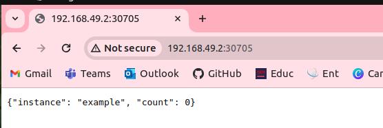

# Simple NodeJS Webapp

The application uses an environment variable `APPLICATION_INSTANCE`.  
This variable will be used by the application to listen on a specific path (i.e. `/${application_instance}/health`).

## Launch the application:

```bash
export APPLICATION_INSTANCE=example
node src/count-server.js
```


docker build -t my-counterjs-app .
docker run -p 8080:8080 my-counterjs-app

docker login

docker tag my-counterjs-app mimi83web/my-counterjs-app:1.0.0

docker push mimi83web/my-counterjs-app:1.0.0

kubectl apply -f fichier_deployment.yaml

kubectl expose deployment counterjs-deployment --type=NodePort --name=counterjs-service --port=8080

